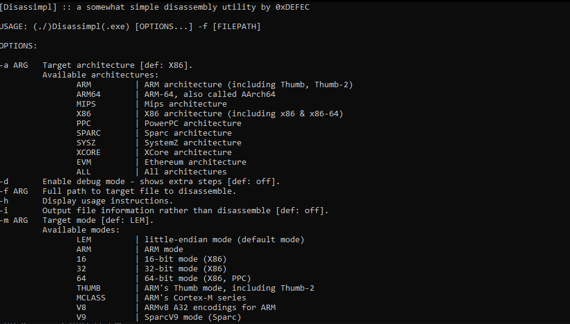
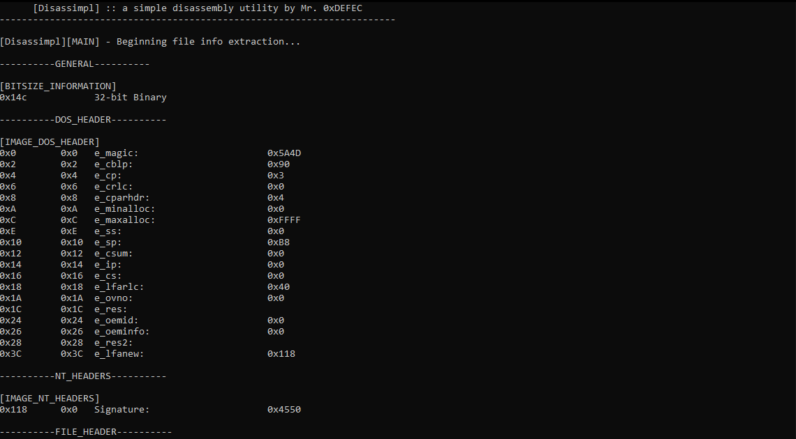
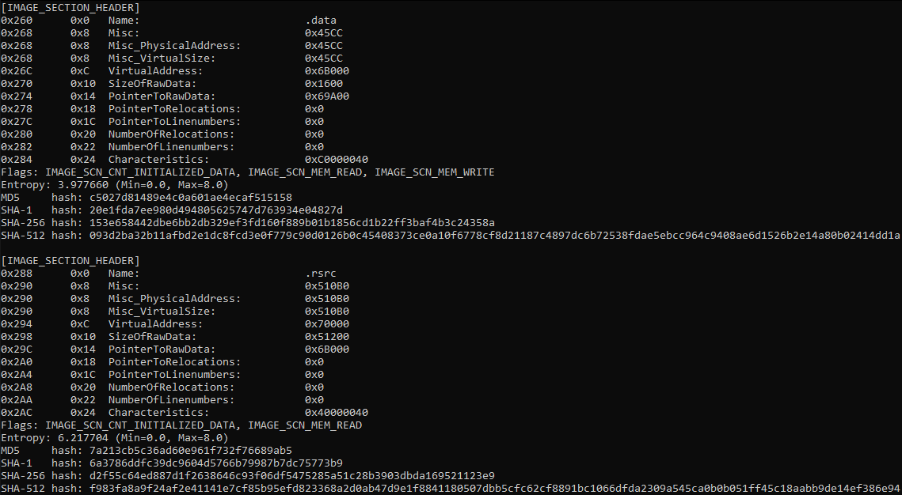
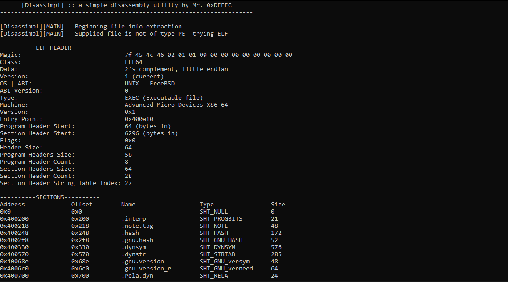
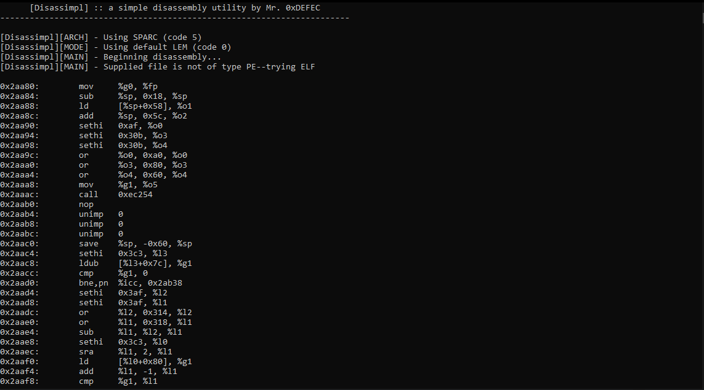

 
Disassimpl is a simple, multi-architecture (or at least it is uspposed to be), multi-mode disassembly utility powered by the Capstone Disassembly Engine found <a href="http://www.capstone-engine.org/">here.</a> It uses the Python's Capstone module and said module is accessed from the Python C API. This adds a few more dependencies, but avoids some of the annoying issues with the Capstone C API. If you're installing a disassembler, you probably won't mind installing a couple Python3 modules anyway, so. 
  
Please note, a large portion of this utility has not been tested, and some architectures may not even disassemble correctly. Considering this entire project is ~500 lines, I am even more confident it will break on some challenges. Furthermore, this isn't even a stable <i>release.</i> I still have concepts in mind that shall be added, so I wouldn't even call this version 1.0; it will likely stay this way for a bit. The only well-tested portion of Disassimpl's functionality is the extraction of the file structure from binaries, but the disassembly function is largely untested (and visibly misbehaves on PPC and MIPS-esc architectures).
  
<h1>Table of Contents</h1>
<ul>
  <li><a href="#supported">Supported Modes & Architectures</a></li>
  <li><a href="#screens">Screenshots</a></li>
</ul>
  
<h1 id="supported">Supported Modes & Architectures</h1>
As stated above, Disassimpl is supposed to support multiple architectures. Below is the list of supposedly supported architectures:
<ul>
  <li>ARM         | ARM architecture (including Thumb, Thumb-2)</li>
  <li>ARM64       | ARM-64, also called AArch64</li>
  <li>MIPS        | Mips architecture</li>
  <li>X86         | X86 architecture (including x86 & x86-64)</li>
  <li>PPC         | PowerPC architecture</li>
  <li>SPARC       | Sparc architecture</li>
  <li>SYSZ        | SystemZ architecture</li>
  <li>XCORE       | XCore architecture</li>
  <li>M68K        | 68K architecture</li>
  <li>TMS320C64X  | TMS320C64x architecture</li>
  <li>M680X       | 680X architecture</li>
  <li>EVM         | Ethereum architecture</li>
</ul>
Furthermore, below you can find the supported modes:
<ul>
  <li>LEM         | little-endian mode (default mode)</li>
  <li>ARM         | ARM mode</li>
  <li>16          | 16-bit mode (X86)</li>
  <li>32          | 32-bit mode (X86)</li>
  <li>64          | 64-bit mode (X86, PPC)</li>
  <li>THUMB       | ARM's Thumb mode, including Thumb-2</li>
  <li>MCLASS      | ARM's Cortex-M series</li>
  <li>V8          | ARMv8 A32 encodings for ARM</li>
  <li>V9          | SparcV9 mode (Sparc)</li>
  <li>MICRO       | MicroMips mode (MIPS)</li>
  <li>MIPS3       | Mips III ISA</li>
  <li>MIPS2       | Mips II ISA</li>
  <li>MIPS32R6    | Mips32r6 ISA</li>
  <li>QPX         | Quad Processing eXtensions mode (PPC)</li>
  <li>M68K000     | M68K 68000 mode</li>
  <li>M68K010     | M68K 68010 mode</li>
  <li>M68K020     | M68K 68020 mode</li>
  <li>M68K030     | M68K 68030 mode</li>
  <li>M68K040     | M68K 68040 mode</li>
  <li>M68K060     | M68K 68060 mode</li>
  <li>BEM         | big-endian mode</li>
  <li>MIPS32      | Mips32 ISA (Mips)</li>
  <li>MIPS64      | Mips64 ISA (Mips)</li>
  <li>M680X6301   | M680X Hitachi 6301,6303 mode</li>
  <li>M680X6309   | M680X Hitachi 6309 mode</li>
  <li>M680X6800   | M680X Motorola 6800,6802 mode</li>
  <li>M680X6801   | M680X Motorola 6801,6803 mode</li>
  <li>M680X6805   | M680X Motorola/Freescale 6805 mode</li>
  <li>M680X6808   | M680X Motorola/Freescale/NXP 68HC08 mode</li>
  <li>M680X6809   | M680X Motorola 6809 mode</li>
  <li>M680X6811   | M680X Motorola/Freescale/NXP 68HC11 mode</li>
  <li>M680XCPU12  | M680X Motorola/Freescale/NXP CPU12</li>
  <li>M680XHCS08  | M680X Freescale/NXP HCS08 mode</li>
</ul>
  
<h1 id="screens">Screenshots</h1>
A view of the help menu:

 
A view of PE and ELF file structure extractions:

 
A view of a disassembled SparcV8 binary:

